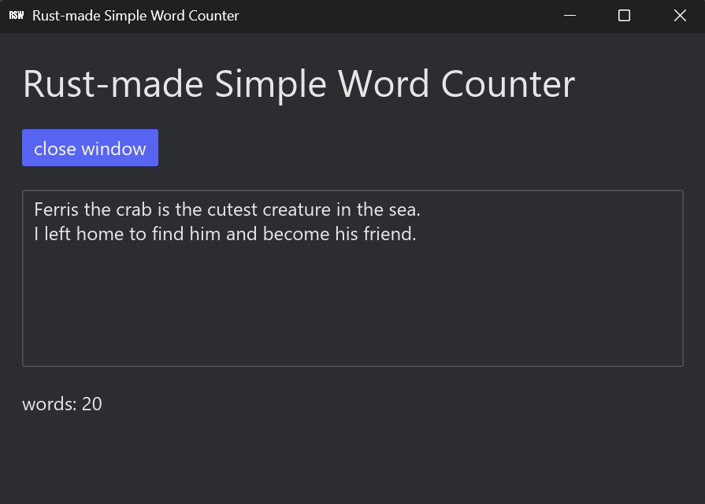

# GUIワードカウントアプリ
WEBレンダリングに頼らないためサクサク動くワードカウントアプリです。フレームワークに[Iced](https://iced.rs/)を使用しました。



## 稼働可能環境
Windowsでのみ動作します。

## 何ができるの？
英文のワードカウントが可能です。

## インストール / 実行方法

### 1. 実行ファイルをダウンロードする場合（推奨）
[Releases](https://github.com/mtugb/Rust-made-Simple-Word-Counter/releases/tag/v1.0.0) ページから `rust_wordcounter.exe` をダウンロードしてください。
ダウンロード後、そのまま実行して使用できます。

### 2. ソースコードからビルドする場合
```$ cargo build --release```
を実行します。

## Q & A
- 英語だけ？\
はい
- windowsだけ？\
はい。windowsのみサポートしてます。
